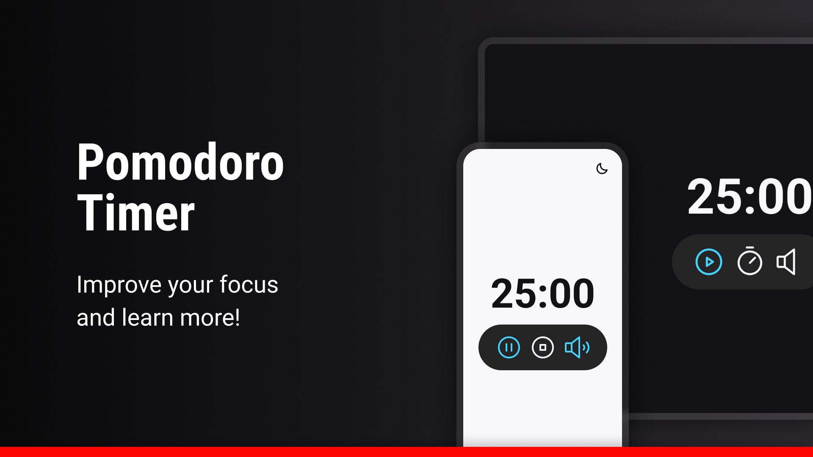

## What is the Pomodoro Technique?
The Pomodoro Technique is a learning approach aimed at increasing focus and productivity.
It combines periods of intense study or work with short and intentional breaks.

## How does it work?
The technique consists of 25-minute study or work sessions without interruptions. After each 25-minute session, there's a 5-minute break for rest or to engage in another unrelated activity. This work and break cycle is repeated four times in a row.

After the fourth session, a longer break of 15 minutes is taken.

## How to evolve with?
Start with 25-minute sessions and 5-minute breaks. Over time, it's possible to increase the study or work time, but not more than 50 minutes per session.

Regular practice of the Pomodoro Technique helps increase mental resilience and concentration over time. It's important to find the balance between intense work periods and adequate breaks to avoid burnout and maintain the effectiveness of the technique.

This simple yet powerful approach provides a clear structure to optimize time and maximize learning. The Pomodoro Technique helps build more effective study habits and achieve more consistent results.

## Technologies
The technologies used were:
- HTML;
- CSS;
- Javascript;
- Figma;

## Layout
You can see the project's layout at [link](https://www.figma.com/file/1ICBolrKFS5TzualqULnbG/Focus-Timer-V2-%E2%80%A2-Projeto-Explorer-(Community)?type=design&node-id=1422-28&mode=design&t=yepYg80yu4RhZppB-0). 
A [Figma](https://www.figma.com) account is required.